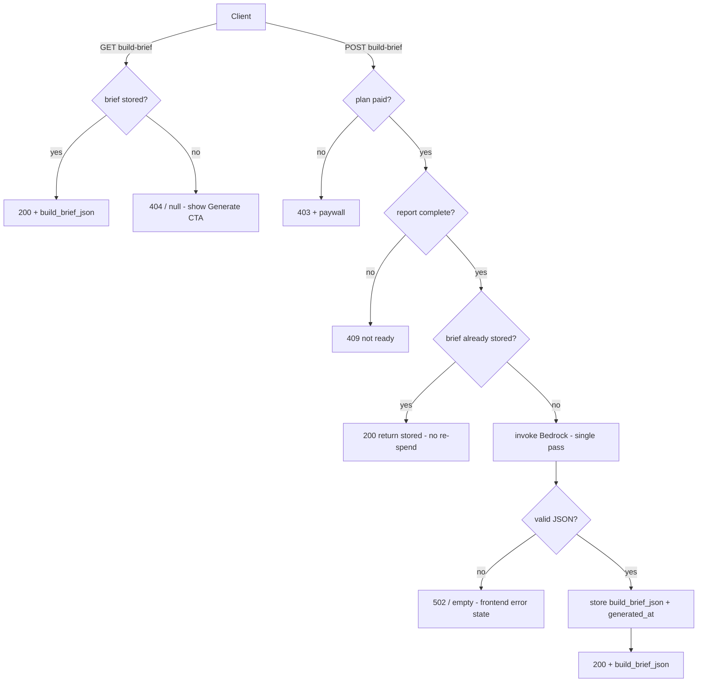

# Build Brief — Backend Wiring (Phase 1, Pro)

**Status:** Design — pending review
**Date:** 2026-05-28
**Scope:** Backend for the already-built Build Brief frontend, plus small frontend consistency cleanups. Architecture diagrams / mermaid rendering remain **Max Phase 2** (deferred, not built).

**Relationship to prior spec:** The product/Phase-1 design lives in [`2026-05-26-build-brief-design.md`](./2026-05-26-build-brief-design.md) (North Star, content, trust framing, schema, frontend). That spec was written before implementation; the frontend has since shipped (types, `useBuildBrief`, `BuildBrief` component, `getBuildBrief`/`generateBuildBrief` stubs, mock data). **This spec wires the backend** and records where today's decisions refine the earlier one.

---

## Deltas from the 2026-05-26 spec

These supersede the corresponding points in the product spec:

1. **Routes move to a dedicated `BuildBriefFunction`** — *not* the existing API Lambda. Keeps `bedrock:InvokeModel` off the fast CRUD Lambda (least privilege) and lets the brief Lambda be tuned for a model call. Mirrors the `MuseSyncFunction` precedent.
2. **No regenerate.** Generate-once per report. POST is idempotent: if a brief already exists, return the stored one (no re-spend).
3. **No daily cap.** With regenerate gone, brief generation is already bounded by the report daily limits (you cannot make more briefs than reports). The atomic-counter / `429` / `capReached` machinery is dropped.
4. **Model = verify-then-plug.** Not pinned to DeepSeek. Confirm the live deployed model, then set the SAM param (lean: Nova 2 Lite — the Summarise stage's founder-prose model, whose inference-profile + IAM are already solved for Muse).

Everything else in the 2026-05-26 spec (content, trust block, vendor-neutral framing, low-tech graceful path, ownership/`409` rules, schema) still holds.

---

## Surface & contract

The frontend already defines this; the backend honors it.

| Method | Path | Returns |
|---|---|---|
| `GET` | `/api/reports/{report_id}/build-brief` | `{ build_brief_json, build_brief_generated_at }`, or `404`/null if not generated |
| `POST` | `/api/reports/{report_id}/build-brief` | Generate-once, store, return the same shape |

- **Gating:** paid only (`pro` / `max` / `admin`) → `403` + paywall payload if not.
- **Precondition:** report must be `complete` (the brief's input is `result_json`) → `409` if not ready.
- **Ownership:** org-scoped, same as `GET /reports/{id}` → `404` for reports the caller does not own.

---

## Request flow



---

## Architecture

### `BuildBriefFunction` (new Lambda)

- Python, Powertools resolver, behind the **existing API GW + standard authorizer**, mounted at both routes above. Mirrors `MuseSyncFunction`.
- **IAM (least privilege):**
  - `bedrock:InvokeModel` scoped to **only** the brief model ARN(s). If the chosen model needs a `us.*` cross-region inference profile (as Nova 2 Lite does), include the inference-profile ARN *and* the underlying foundation-model ARNs across all routed regions — same pattern already in the template for `BedrockModelIdMuseChat`.
  - `DynamoDBCrudPolicy` scoped to the Reports table (read the report's `result_json`; write the brief fields).
- **Plan freshness:** resolve plan from the `USER#{user_id}` DynamoDB row (not the ~5-min-cached authorizer snapshot), same pattern as `_atomic_check_and_increment`, so a just-upgraded user is not wrongly `403`'d.

### Data model

Stored on the existing report item (1:1, no new table, same org-scoped key space):

- `build_brief_json` — the structured brief (schema below).
- `build_brief_generated_at` — ISO8601.

### Generation — single synchronous Bedrock pass

- **Input:** the completed report's `result_json` (vertical, oneliner, scores, competitors, gaps, recommendation) + `idea_text`.
- **Invoke:** reuse the provider-aware `call_llm()` shape from `ai-orchestration` (payload builder, retry/backoff, token tracking). **Default: copy/adapt the small invoke helper into the new Lambda** so it stays self-contained (the repo keeps each Lambda dir independent); a shared Lambda layer is a possible later refactor, not Phase 1. Handles nova / anthropic / deepseek, so the verified model slots in without code changes.
- **Output:** the exact `build_brief_json` schema the frontend adapter expects. Parse + validate; malformed/empty → `502` (frontend shows its error state).
- **Model:** behind a new SAM param `BedrockModelIdBuildBrief`. **Value TBD pending live verification** (see Open item). Synchronous within API GW's 29s window — a single bounded brief lands in a few seconds with comfortable margin.
- **Low-tech graceful path:** prompt instructs `is_tech_dominant: "false"` for non-digital ideas; `foundation` collapses to website + payments; complexity stays low. Never fabricate a stack (per the 2026-05-26 trust framing).

### `build_brief_json` schema

```json
{
  "is_tech_dominant": "true | false",
  "complexity_score": "string-number",
  "complexity_label": "string",
  "complexity_drivers": ["string"],
  "capabilities": [
    { "name": "", "description": "", "build_or_buy": "build | buy", "recommendation": "" }
  ],
  "foundation": [
    { "primitive": "", "why": "", "cloud_examples": "S3 / Blob / Cloud Storage" }
  ],
  "mvp_scope": "string",
  "effort_estimate": { "timeframe": "", "team_shape": "" },
  "technical_risks": [ { "title": "", "description": "" } ]
}
```

Mirrors `result_json` conventions (string-number scores, object arrays); `frontend/src/adapter.ts#adaptBuildBrief` already maps it. Complexity is **re-derived** inside the brief pass from `result_json` + `idea_text` (lower-touch than persisting `estimated_complexity` at Summarise).

---

## Error handling

| Condition | Response |
|---|---|
| Not paid | `403` + paywall payload (defense in depth; UI already locks) |
| Report not complete | `409` |
| Report not owned / not found | `404` |
| Model returns malformed/empty JSON | `502` (frontend error state) |
| Transient Bedrock error | retry/backoff in `call_llm`; exhausted → `502` |

---

## Frontend consistency cleanup (small)

The frontend is built; only these align it with the decisions above and with the report:

- **Markdown export:** keep the existing client-side `buildBriefMarkdown()`, placed/styled like the report's bottom **Export** affordance (`ReportView.tsx` export group) for UI/UX consistency. No backend export endpoint.
- **Remove regenerate:** drop the regenerate action from the brief's action row and the now-dead `429` / `capReached` / regenerate branch in `useBuildBrief`. `generate()` stays for the first-time Generate CTA.
- **Docs:** update `system.md` + `CLAUDE.md`, which currently document the action row as "copy as markdown · regenerate".

---

## Open item (before merge)

**Verify the deployed model, then set `BedrockModelIdBuildBrief`.** `samconfig.toml` does not override the model params, and a deploy uses CloudFormation's previous value, so the repo defaults (Nova/DeepSeek) may not match what is live. Confirm via:

```
aws lambda get-function-configuration --function-name <AiOrchestrationFn> \
  --query 'Environment.Variables.{Parse:BEDROCK_MODEL_ID_PARSE,Analyse:BEDROCK_MODEL_ID_ANALYSE,Summarise:BEDROCK_MODEL_ID_SUMMARISE}'
```

Then set the brief param to the confirmed, access-enabled model (lean: Nova 2 Lite via its `us.*` inference profile, matching Muse) and scope the IAM ARNs accordingly.

---

## Deferred — Max Phase 2 (reaffirmed, not built)

- **Cloud-specific reference architecture + system diagrams** (mermaid rendered in the product UI). Reaffirmed this session as Max-only; Pro stays vendor-neutral and diagram-free.
- **PDF export**, per-brief model selection, cross-report shared-infrastructure synthesis (reserved `gsi1pk=ORG#…`).
- **Muse grounding in the brief** and **brief-generation analytics** (Muse-style Streams → Firehose → Parquet → Athena) — easy once the seams exist.
